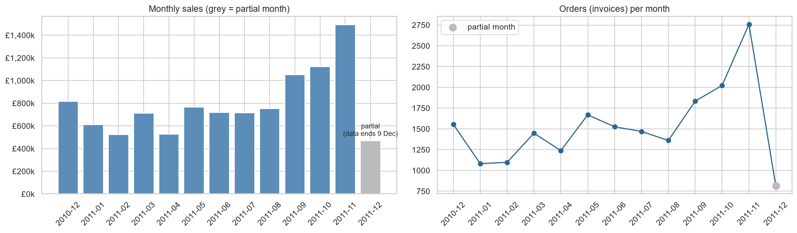

# Online Retail Sales: Cleaning and EDA 

Exploratory analysis of a UK online gift retailer (541,909 transaction lines, 1 Dec 2010 to 9 Dec 2011), built around one idea:
**cleaning decisions are analytical decisions, so investigate them, document them and test them.**

## Highlights

- **Investigated before cleaning.** Found two huge orders (74,215 jars; 80,995 paper-craft items) that were *cancelled minutes after being placed*, and ~2,300 postage/fee/adjustment lines mixed in with products.
- **Measured the impact.** Naive cleaning overstates sales by **£372k (3.6%)**, ranks `DOTCOM POSTAGE` as the #1 "product", and counts the cancelled mega-orders. Corrected, the top product is the Regency Cakestand.
- **Business findings** (all with written interpretation in the notebook): strong Sep-Nov seasonality driven by order count, UK = 84% of sales, a few export accounts placing 5-6x larger orders, top 20% of customers = 74% of sales, 75% of sales between 10:00 and 15:59, no Saturday trading.
- **Core maths on real data:** dot product vs loop (100x+ faster), variance by hand, outlier rules on skewed data, conditional probability, Pearson vs Spearman.



## Layout

```
data/            put "Online Retail.xlsx" here (UCI Online Retail dataset)
notebooks/       retail_sales_eda_final.ipynb      <- the analysis, with interpretation under every result
src/
  cleaning.py    load_raw, standardize_types, flag_rows, find_reversed_orders, clean_transactions (+ audit report)
  analysis.py    monthly_sales, weekday_sales, top_products, country_summary, customer_concentration, ...
tests/           9 pytest tests (cleaning rules, reversed-order matching, partial-month flag, ...)
outputs/         charts/, cleaning_report.csv, kpis.csv   (the notebook also writes cleaned_online_retail.csv)
```

## Run it

Download the dataset from <https://archive.ics.uci.edu/dataset/352/online+retail> and save it as `data/Online Retail.xlsx`
(if the file is missing, the loader tries to download it with `ucimlrepo`).

```powershell
python -m pip install -r requirements.txt
python -m pytest
python -m jupyter lab notebooks/retail_sales_eda_final.ipynb
```

Use the cleaning functions on their own:

```python
from src.cleaning import load_raw, clean_transactions
result = clean_transactions(load_raw())
result.clean    # analysis-ready sales rows
result.returns  # cancellation rows
result.report   # what each step removed, and why
```

## Limitations

Gross sales only (partial returns not netted; only exact full reversals are matched, which is a heuristic); one year of data with a partial last month;
revenue not profit; exact duplicates assumed to be logging errors.
